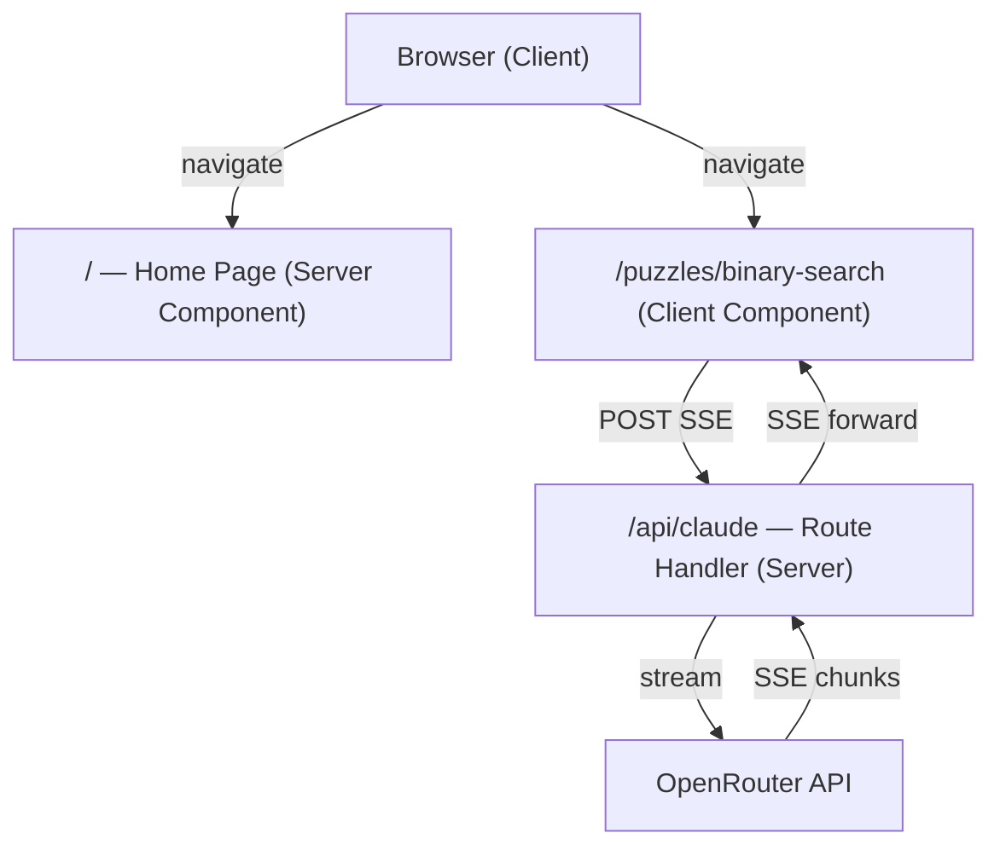
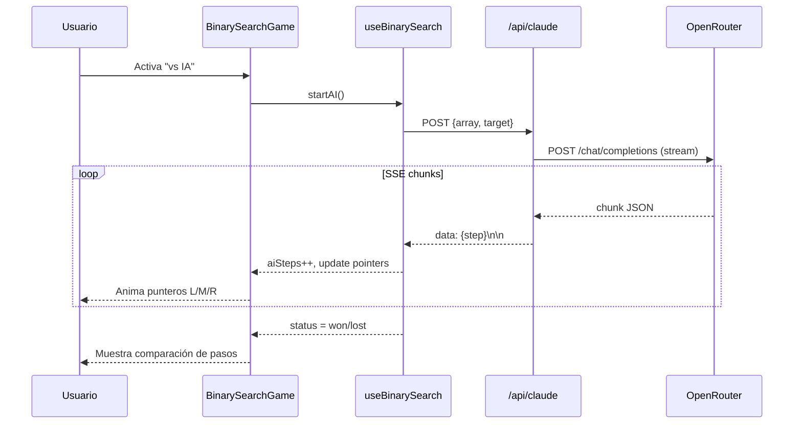

# Design Document — AI Reasoning Playground

## Overview

AI Reasoning Playground es una aplicación web educativa que demuestra empíricamente los límites de los Large Reasoning Models (LRMs) según el paper "The Illusion of Thinking" (Apple, 2025). La app presenta 4 puzzles algorítmicos interactivos donde el usuario compite contra modelos de IA, observando en tiempo real cómo el razonamiento del modelo colapsa a medida que crece la complejidad del problema.

El MVP entrega el scaffolding completo de la aplicación y el primer puzzle funcional: búsqueda binaria con modo "vs IA" usando streaming de respuestas desde OpenRouter vía SSE.

### Tecnologías principales

- Next.js 14 (App Router) + TypeScript strict
- Tailwind CSS v3 + Framer Motion
- OpenRouter API (streaming SSE)
- Docker (producción)

---

## Architecture

La aplicación sigue la arquitectura estándar de Next.js 14 App Router con separación clara entre Server Components, Client Components y Route Handlers.



### Flujo de datos — Modo vs IA



### Decisiones de arquitectura

- **App Router sobre Pages Router**: Permite Server Components para la home page (sin JS innecesario en cliente) y Route Handlers nativos para SSE.
- **SSE sobre WebSockets**: El flujo es unidireccional (servidor → cliente), SSE es más simple y no requiere infraestructura adicional.
- **OpenRouter sobre OpenAI directo**: Permite cambiar de modelo sin modificar código; clave única para múltiples proveedores.
- **Hook `useBinarySearch`**: Encapsula toda la lógica de juego, manteniendo los componentes puramente presentacionales y la lógica testeable en aislamiento.

---

## Components and Interfaces

### Árbol de componentes

```
app/
├── page.tsx                          # Home — Server Component
├── layout.tsx                        # Root layout
├── not-found.tsx                     # Redirect a /
├── puzzles/
│   ├── binary-search/page.tsx        # Client Component wrapper
│   ├── sorting/page.tsx
│   ├── hanoi/page.tsx
│   └── river-crossing/page.tsx
└── api/
    └── claude/route.ts               # Route Handler SSE

components/
├── PuzzleCard.tsx                    # Tarjeta de puzzle en home
├── binary-search/
│   ├── BinarySearchGame.tsx          # Orquestador del juego
│   └── BinarySearchBoard.tsx         # Visualización del array
├── sorting/
│   └── SortingVisualizer.tsx
├── hanoi/
│   └── HanoiSimulator.tsx
└── river-crossing/
    └── RiverCrossingSimulator.tsx

hooks/
└── useBinarySearch.ts                # Lógica del juego de búsqueda binaria

lib/
├── binarySearch.ts                   # Algoritmo puro (sin estado React)
├── hanoi.ts                          # Lógica de validación Hanoi
├── riverCrossing.ts                  # Lógica de validación River Crossing
└── openrouter.ts                     # Cliente OpenRouter (modelo fijo configurado en código)
```

### Interfaces de componentes clave

```typescript
// hooks/useBinarySearch.ts
interface BinarySearchState {
  array: number[];
  target: number;
  left: number;
  right: number;
  mid: number;
  steps: number;
  aiSteps: number;
  aiPointers: { left: number; mid: number; right: number } | null;
  status: 'idle' | 'playing' | 'won' | 'lost';
  aiStatus: 'idle' | 'playing' | 'won' | 'error';
  errorMessage: string | null;
}

interface UseBinarySearchReturn {
  state: BinarySearchState;
  makeMove: (direction: 'left' | 'right') => void;
  startAI: () => void;
  reset: () => void;
}

// components/binary-search/BinarySearchBoard.tsx
interface BinarySearchBoardProps {
  array: number[];
  target: number;
  left: number;
  mid: number;
  right: number;
  aiPointers?: { left: number; mid: number; right: number } | null;
}

// components/PuzzleCard.tsx
interface PuzzleCardProps {
  title: string;
  description: string;
  href: string;
  hasAIMode?: boolean;
  icon: React.ReactNode;
}

// app/api/claude/route.ts — Request body
interface AIRequestBody {
  array: number[];
  target: number;
}

// SSE step payload
interface AIStep {
  left: number;
  mid: number;
  right: number;
  comparison: 'less' | 'greater' | 'equal';
  stepNumber: number;
  found?: boolean;
}
```

### Route Handler — `/api/claude`

El handler acepta POST, valida el body, construye el prompt y abre un `ReadableStream` que reenvía los chunks de OpenRouter como SSE.

```typescript
// Prompt template
const prompt = `
You are playing binary search on the array: [${array.join(', ')}]
Target: ${target}

Solve binary search step by step. For each step, emit ONLY a JSON object on a single line:
{"left": <L>, "mid": <M>, "right": <R>, "comparison": "less"|"greater"|"equal", "stepNumber": <N>, "found": true|false}

Start with left=0, right=${array.length - 1}, mid=Math.floor((left+right)/2).
Stop when found=true or left > right.
`;
```

---

## Data Models

### BinarySearchState

```typescript
type GameStatus = 'idle' | 'playing' | 'won' | 'lost';
type AIStatus = 'idle' | 'playing' | 'won' | 'error';

interface BinarySearchState {
  array: number[];        // Array ordenado de enteros
  target: number;         // Elemento a encontrar
  left: number;           // Índice izquierdo actual
  right: number;          // Índice derecho actual
  mid: number;            // Índice medio actual = floor((left+right)/2)
  steps: number;          // Pasos del usuario
  aiSteps: number;        // Pasos del AIPlayer
  aiPointers: { left: number; mid: number; right: number } | null;
  status: GameStatus;
  aiStatus: AIStatus;
  errorMessage: string | null;
}
```

### Invariantes del estado

- `0 <= left <= mid <= right < array.length` mientras `status === 'playing'`
- `mid === Math.floor((left + right) / 2)` siempre
- `array` está ordenado de forma ascendente
- `target` siempre existe en `array`
- `steps >= 0` y `aiSteps >= 0`
- `status === 'won'` implica `array[mid] === target`
- `status === 'lost'` implica `left > right`

### HanoiState

```typescript
interface HanoiState {
  discs: number;          // 1–12
  pegs: number[][];       // 3 pegs, cada uno con stack de disc IDs (mayor = más grande)
  moves: number;          // Movimientos realizados
  optimalMoves: number;   // 2^discs - 1
  status: 'idle' | 'playing' | 'won';
}
```

### RiverCrossingState

```typescript
type Actor = 'wolf' | 'sheep' | 'cabbage';
type Shore = 'left' | 'right';

interface RiverCrossingState {
  leftShore: Set<Actor | 'farmer'>;
  rightShore: Set<Actor | 'farmer'>;
  boatPosition: Shore;
  trips: number;
  status: 'playing' | 'won';
  violationMessage: string | null;
}
```

### SortingState

```typescript
interface SortingState {
  array: number[];
  comparing: [number, number] | null;   // Índices actualmente comparados
  sorted: number[];                      // Índices ya ordenados
  speed: 'slow' | 'normal' | 'fast';
  status: 'idle' | 'playing' | 'paused' | 'done';
}
```

### ComplexityThreshold — eliminado del MVP

El `ComplexityPanel` y el archivo `complexity-thresholds.json` quedan fuera del scope. El modelo de OpenRouter se fija directamente en `lib/openrouter.ts` como constante.

---

## Error Handling

### StreamingHandler — `/api/claude`

| Condición | Comportamiento |
|---|---|
| `OPENROUTER_API_KEY` no definida | HTTP 500, `{"error": "OPENROUTER_API_KEY is not configured"}` |
| Body inválido (falta `array` o `target`) | HTTP 400, `{"error": "Invalid request body"}` |
| `array` no es array ordenado | HTTP 400, `{"error": "array must be a sorted array of numbers"}` |
| OpenRouter retorna error HTTP | Reenviar el mismo código + `{"error": "<mensaje>"}` |
| Conexión SSE interrumpida | El stream se cierra; el cliente detecta el cierre y muestra mensaje de reintento |
| Chunk de OpenRouter no parseable | Ignorar el chunk y continuar el stream |

### useBinarySearch hook

| Condición | Comportamiento |
|---|---|
| `makeMove` con `status !== 'playing'` | No-op silencioso |
| `startAI` con `aiStatus === 'playing'` | No-op silencioso (evita conexiones duplicadas) |
| Error en conexión SSE | `aiStatus = 'error'`, `errorMessage` con descripción |
| SSE interrumpida | `aiStatus = 'error'`, `errorMessage = 'Connection interrupted'` |

### HanoiSimulator

| Condición | Comportamiento |
|---|---|
| Movimiento ilegal (disco mayor sobre menor) | Rechazar, mostrar mensaje, estado sin cambios |
| Peg origen vacío | Rechazar, mostrar mensaje |

### RiverCrossingSimulator

| Condición | Comportamiento |
|---|---|
| Lobo solo con oveja | Rechazar, `violationMessage = 'El lobo se comería a la oveja'` |
| Oveja sola con repollo | Rechazar, `violationMessage = 'La oveja se comería el repollo'` |
| Bote sin barquero | Rechazar (el barquero siempre debe estar en el bote) |

---

## Testing Strategy

Sin tests para el MVP. La validación se hace manualmente en el navegador.
